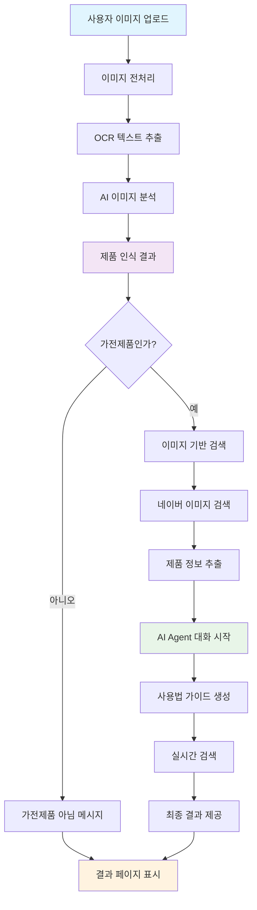
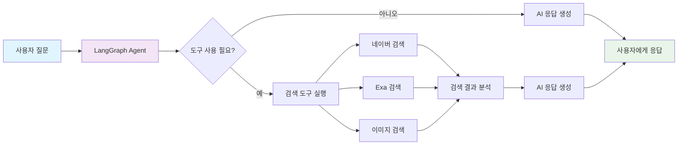
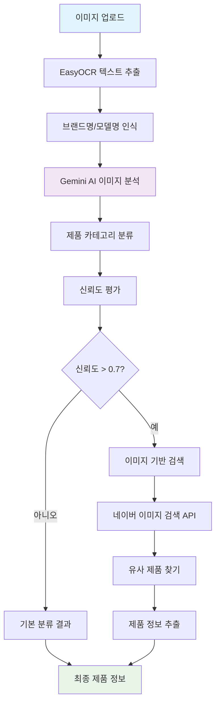
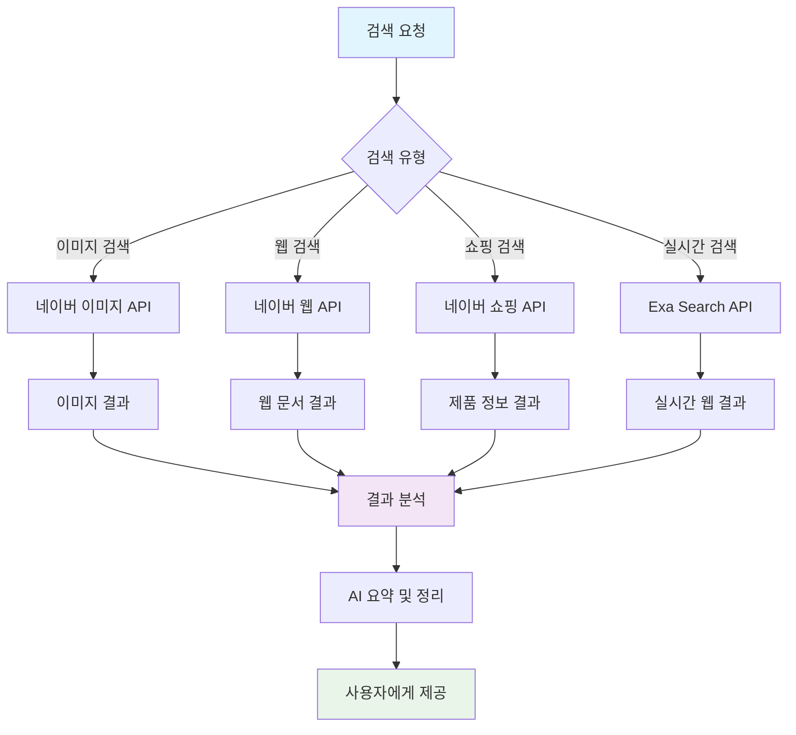
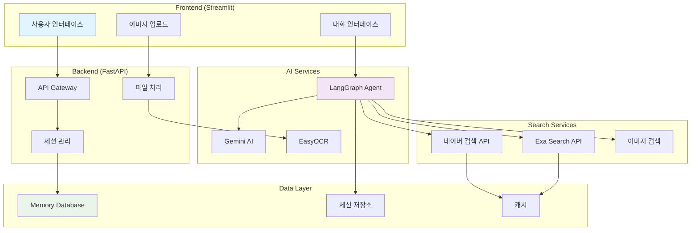

# 5060 중장년층 가전제품 사용법 안내 Agent

## 프로젝트 개요
5060 중장년층이 가전제품 설명서의 작은 글씨로 인해 겪는 불편함을 해결하기 위한 AI 기반 웹 서비스 프로토타입입니다.

## 주요 기능
- 📷 **이미지 기반 제품 인식**: 가전제품을 촬영하면 AI가 브랜드와 모델을 자동 인식
- 🤖 **AI Agent 대화**: LangGraph 기반 대화형 사용법 안내
- 📖 **시각적 가이드**: 중장년층 친화적인 단계별 사용법 제공
- 🔍 **실시간 검색**: Naver/Exa Search를 통한 최신 사용법 정보 수집

## 기술 스택
- **Backend**: FastAPI + Python 3.11
- **Frontend**: Streamlit
- **AI**: LangGraph + Gemini-2.5-flash-preview-05-20
- **Tools**: Naver Search MCP, Exa Search MCP

## 사용한 AI 모델

### 🤖 핵심 AI 모델
- **Google Gemini 2.5 Flash Preview**: 
  - 제품 이미지 분석 및 인식
  - 자연어 대화 및 사용법 가이드 생성
  - 실시간 제품 정보 추출

### 🔍 컴퓨터 비전 & OCR
- **EasyOCR**: 
  - 이미지에서 텍스트 추출 (한국어/영어)
  - 브랜드명, 모델명, 제품 정보 인식
  - 신뢰도 기반 텍스트 필터링

### 🧠 AI 프레임워크
- **LangGraph**: 
  - 대화형 AI Agent 구축
  - 복잡한 워크플로우 관리
  - 도구 사용 및 메모리 관리

- **LangChain**: 
  - AI 모델 통합 및 프롬프트 관리
  - 검색 도구 연동
  - 메모리 및 세션 관리

### 🔧 검색 및 도구
- **네이버 검색 API**:
  - 이미지 검색: 유사한 제품 이미지 찾기
  - 웹 검색: 최신 제품 정보 수집
  - 쇼핑 검색: 제품 가격 및 상세 정보

- **Exa Search API**:
  - 실시간 웹 검색
  - 학술 자료 및 전문 정보 수집

### 📊 데이터 처리
- **OpenCV**: 이미지 전처리 및 분석
- **Pillow (PIL)**: 이미지 처리 및 변환
- **NumPy**: 수치 계산 및 배열 처리
- **Pandas**: 데이터 분석 및 처리

### 🌐 웹 기술
- **FastAPI**: 고성능 백엔드 API
- **Streamlit**: 대화형 웹 인터페이스
- **Uvicorn**: ASGI 서버
- **aiohttp**: 비동기 HTTP 클라이언트

### 🗄️ 데이터베이스 & 메모리
- **Memory Database**: 세션 및 임시 데이터 저장
- **LangSmith**: AI 모델 성능 모니터링
- **Python-dotenv**: 환경 변수 관리

## 설치 및 실행

### 1. 환경 설정

#### API 키 발급
1. **Google API 키**: [Google Cloud Console](https://console.cloud.google.com/)에서 Gemini API 키 발급
2. **네이버 API 키**: [네이버 개발자 센터](https://developers.naver.com/)에서 애플리케이션 등록 후 클라이언트 ID와 시크릿 발급

#### 환경 변수 설정
```bash
# 환경 변수 설정
cp env.example .env
# .env 파일을 열어서 API 키 설정
```

`.env` 파일 예시:
```env
# API 키 설정
GOOGLE_API_KEY=your_google_api_key_here
NAVER_CLIENT_ID=your_naver_client_id_here
NAVER_CLIENT_SECRET=your_naver_client_secret_here

# 서버 설정
BACKEND_HOST=localhost
BACKEND_PORT=8000
FRONTEND_HOST=localhost
FRONTEND_PORT=8501
```

### 2. 백엔드 실행
```bash
cd backend
pip install -r requirements.txt
python -m uvicorn main:app --reload --host 0.0.0.0 --port 8000
```

### 3. 프론트엔드 실행
```bash
cd frontend
pip install -r requirements.txt
streamlit run app.py --server.port 8501
```

## 프로젝트 구조
```
proto_jr/
├── backend/                    # FastAPI 백엔드
│   ├── api/                   # API 라우터
│   │   ├── routes/           # 엔드포인트 정의
│   │   └── dependencies.py   # 의존성 주입
│   ├── core/                 # 핵심 AI 로직
│   │   ├── agent/           # LangGraph Agent
│   │   │   ├── agent_core.py # 메인 Agent 클래스
│   │   │   ├── prompts/     # 시스템 프롬프트
│   │   │   └── tools/       # 검색 도구들
│   │   └── memory/          # 메모리 관리
│   ├── services/            # 비즈니스 로직
│   │   ├── product_recognition_service.py # 제품 인식
│   │   ├── simple_product_search_service.py # 제품 검색
│   │   └── chat_service.py  # 대화 서비스
│   ├── config/              # 설정 관리
│   ├── models/              # 데이터 모델
│   ├── utils/               # 유틸리티
│   └── main.py              # 애플리케이션 진입점
├── frontend/                 # Streamlit 프론트엔드
│   ├── pages/               # 페이지 컴포넌트
│   ├── components/          # UI 컴포넌트
│   ├── services/            # API 클라이언트
│   └── app.py               # 메인 앱
├── shared/                   # 공통 모듈
├── tests/                    # 테스트 코드
├── docs/                     # 문서 및 UX 와이어프레임
└── requirements.txt          # 의존성 목록
```

## 주요 기능 상세

### 📷 이미지 기반 제품 인식
- **OCR 텍스트 추출**: EasyOCR을 사용한 브랜드명, 모델명 인식
- **AI 이미지 분석**: Gemini 2.5 Flash로 제품 카테고리 분류
- **이미지 검색**: 네이버 이미지 검색 API로 유사 제품 찾기
- **신뢰도 평가**: 확신도 기반 결과 필터링

### 🤖 AI Agent 대화 시스템
- **LangGraph 기반 워크플로우**: 복잡한 대화 흐름 관리
- **도구 사용**: 검색, 이미지 분석 등 다양한 도구 활용
- **메모리 관리**: 세션별 대화 기록 및 컨텍스트 유지
- **자연어 처리**: 한국어 기반 자연스러운 대화

### 🔍 실시간 검색 시스템
- **네이버 검색 API**: 이미지, 웹, 쇼핑 검색 통합
- **Exa Search**: 실시간 웹 검색 및 학술 자료 수집
- **검색 결과 분석**: AI 기반 검색 결과 요약 및 정리
- **캐싱 시스템**: 검색 결과 효율적 관리

### 📖 사용법 가이드 생성
- **단계별 가이드**: 중장년층 친화적인 설명
- **시각적 요소**: 이미지와 함께 제공되는 가이드
- **안전 정보**: 제품별 안전 주의사항 포함
- **트러블슈팅**: 일반적인 문제 해결 방법 제공

## 시스템 프로세스 다이어그램

### 🔄 전체 시스템 흐름


### 🤖 AI Agent 워크플로우


### 📷 제품 인식 프로세스


### 🔍 검색 시스템 아키텍처


### 🏗️ 시스템 아키텍처


## 개발 진행 상황
- ✅ **프로젝트 초기 설정**: 기본 구조 및 환경 설정 완료
- ✅ **FastAPI 백엔드**: API 서버 및 라우터 구현 완료
- ✅ **AI Agent 시스템**: LangGraph 기반 대화형 Agent 구현 완료
- ✅ **제품 인식 서비스**: OCR 및 AI 기반 제품 인식 구현 완료
- ✅ **이미지 검색 시스템**: 네이버 이미지 검색 API 통합 완료
- ✅ **Streamlit 프론트엔드**: 사용자 인터페이스 구현 완료
- ✅ **검색 도구 통합**: 네이버/Exa 검색 API 연동 완료
- 🔄 **API 키 설정**: 네이버 API 키 권한 설정 진행 중
- ⏳ **성능 최적화**: 검색 결과 캐싱 및 응답 속도 개선 예정
- ⏳ **테스트 코드**: 단위 테스트 및 통합 테스트 작성 예정

## 라이선스
MIT License 