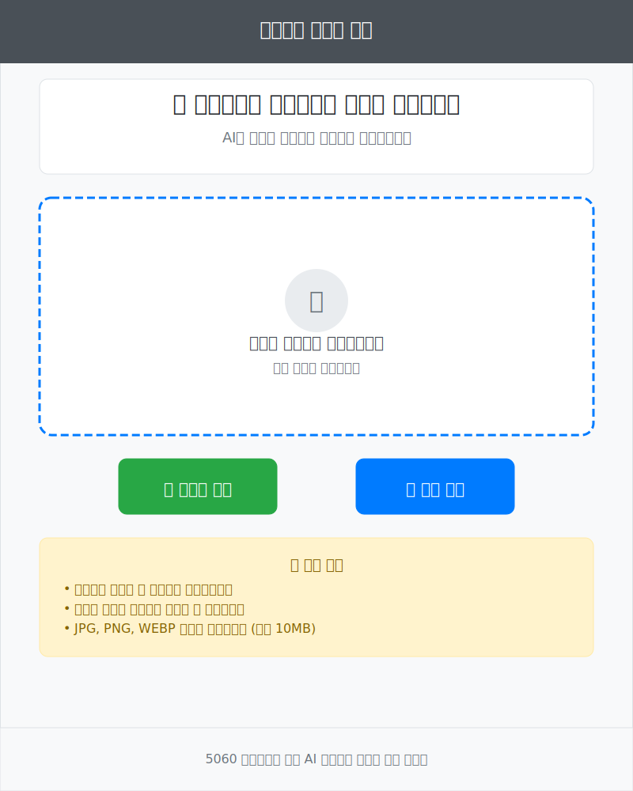

# UX 와이어프레임
## 5060 중장년층 가전제품 사용법 안내 Agent 프로토타입

## 1. 메인 페이지 (Main Page)

### 기능 개요
- 사용자가 처음 접속하는 랜딩 페이지
- 이미지 업로드 및 카메라 촬영 기능 제공
- 중장년층 친화적인 대형 버튼과 명확한 안내 메시지

### 주요 구성 요소
- **헤더**: 서비스 제목 및 브랜딩
- **타이틀 섹션**: 서비스 설명 및 사용 방법 안내
- **이미지 업로드 영역**: 드래그앤드롭 지원 업로드 존
- **버튼 영역**: 카메라 촬영 및 파일 선택 버튼
- **안내 메시지**: 사용법 및 지원 파일 형식 안내
- **푸터**: 서비스 정보

### 와이어프레임

### UX 고려사항
- **큰 버튼**: 중장년층이 쉽게 클릭할 수 있는 70px 높이의 버튼
- **명확한 텍스트**: 20px 이상의 폰트 크기로 가독성 확보
- **직관적 아이콘**: 📸, 📁 등 이해하기 쉬운 이모지 활용
- **색상 대비**: 충분한 명도 대비로 시각적 접근성 향상

---

## 2. 분석 페이지 (Analysis Page)

### 기능 개요
- 업로드된 이미지를 AI가 분석하는 과정을 시각적으로 표시
- 진행률 바와 단계별 상태 표시로 사용자 불안감 해소
- 예상 완료 시간 안내로 대기 시간에 대한 명확한 기대치 제공

### 주요 구성 요소
- **업로드된 이미지 영역**: 사용자가 업로드한 가전제품 이미지 미리보기
- **분석 진행 상태**: 현재 진행 중인 작업 표시
- **진행률 바**: 분석 완료율을 시각적으로 표시 (0-100%)
- **분석 단계 표시**: 체크리스트 형태의 단계별 진행 상황
- **로딩 스피너**: 처리 중임을 나타내는 애니메이션
- **예상 시간 안내**: 완료까지 남은 시간 정보

### 와이어프레임

### UX 고려사항
- **시각적 피드백**: 진행률 바와 체크마크로 명확한 상태 표시
- **단계별 안내**: 복잡한 AI 처리 과정을 3단계로 단순화
- **대기 시간 관리**: 예상 시간 표시로 사용자 불안감 최소화
- **애니메이션 효과**: 부드러운 로딩 스피너로 시스템 작동 확신 제공

---

## 3. 결과 페이지 (Result Page)

### 기능 개요
- AI 분석 결과 및 인식된 제품 정보 표시
- 기본 사용법 가이드를 단계별로 제공
- 추가 질문을 위한 채팅 인터페이스 연결점 제공

### 주요 구성 요소
- **제품 인식 결과**: 브랜드, 모델명, 카테고리, 인식 정확도
- **기본 사용법 가이드**: 4단계 기본 사용법을 번호와 함께 표시
- **안전 주의사항**: 중요한 안전 정보를 별도 박스로 강조
- **추가 질문 영역**: AI와 대화할 수 있는 입력 필드
- **새로운 제품 분석 버튼**: 다른 제품 분석을 위한 리셋 기능

### 와이어프레임

### UX 고려사항
- **성공 피드백**: 녹색 테두리와 체크마크로 성공적인 인식 표시
- **단계별 가이드**: 번호가 있는 원형 아이콘으로 순서 명확화
- **안전 강조**: 노란색 배경으로 주의사항 시각적 강조
- **연속성**: 추가 질문 유도로 더 깊은 학습 기회 제공
- **재사용성**: 새로운 제품 분석 버튼으로 서비스 재이용 유도

---

## 4. 채팅 페이지 (Chat Page)

### 기능 개요
- AI Agent와의 실시간 대화형 인터페이스
- 사용자의 구체적인 질문에 대한 맞춤형 답변 제공
- 추천 질문 버튼으로 질문 아이디어 제공

### 주요 구성 요소
- **제품 정보 요약**: 현재 분석 중인 제품 정보 상단 고정 표시
- **채팅 영역**: 사용자와 AI의 대화 내용을 말풍선 형태로 표시
- **사용자 메시지**: 파란색 말풍선으로 오른쪽 정렬
- **AI 응답**: 회색 말풍선으로 왼쪽 정렬, 상세한 단계별 답변
- **추천 질문**: 자주 묻는 질문들을 버튼 형태로 제공
- **메시지 입력 영역**: 새로운 질문 입력을 위한 텍스트 필드

### 와이어프레임

### UX 고려사항
- **대화 흐름**: 일반적인 메신저 UI 패턴으로 친숙함 제공
- **맞춤형 답변**: 제품별 특화된 상세 가이드 제공
- **추천 질문**: 질문하기 어려워하는 중장년층을 위한 가이드 제공
- **연속 대화**: 이전 대화 맥락을 유지하는 자연스러운 대화 흐름
- **시각적 구분**: 사용자와 AI 메시지를 색상과 정렬로 명확히 구분

---

## 전체 UX 플로우

### 사용자 여정 (User Journey)
1. **메인 페이지**: 이미지 업로드 또는 카메라 촬영
2. **분석 페이지**: AI 분석 과정 실시간 모니터링
3. **결과 페이지**: 제품 인식 결과 및 기본 사용법 확인
4. **채팅 페이지**: 추가 질문 및 상세 가이드 획득

### 주요 UX 원칙
- **단순성**: 복잡한 기능을 3-4단계로 단순화
- **명확성**: 큰 폰트, 명확한 색상 대비, 직관적 아이콘 사용
- **피드백**: 모든 사용자 행동에 대한 즉각적인 시각적 피드백
- **접근성**: 중장년층의 시각적, 인지적 특성을 고려한 디자인
- **연속성**: 페이지 간 일관된 디자인 언어와 네비게이션 패턴

### 반응형 고려사항
- **모바일 우선**: 스마트폰 사용이 많은 중장년층을 위한 모바일 최적화
- **터치 친화적**: 최소 44px 이상의 터치 타겟 크기
- **가독성**: 모든 디바이스에서 16px 이상의 폰트 크기 유지
- **간격**: 충분한 여백으로 실수 클릭 방지 